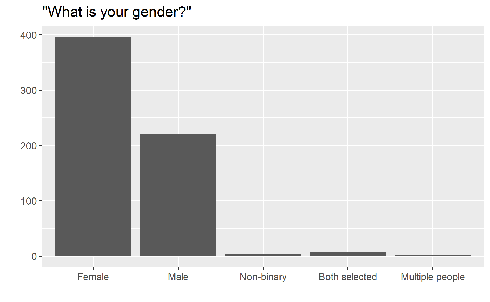

```{r load-packages, message=FALSE}
library(tidyverse)
library(openintro)
library(readr)
library(dplyr)
library(forcats)
```

# Introduction

### Research Question
> Describe your research question.

1. How does a person’s gender, age, ethnicity, annual income, housing status, and identity as a student affect their opinion of the cost of housing?
2. How does a person’s gender, age, housing status, and identity as a student affect how safe they feel walking at night?


### Motivation
> Explain what motivated you to investigate this question.

&nbsp;&nbsp;&nbsp;&nbsp;&nbsp;&nbsp;Problems within a community, such as prohibitive housing costs, declining sense of neighborhood safety, or increasing distrust in police, can be obvious and troubling to some groups of people and invisible to others. Additionally, as community problems increase in severity, they can affect some groups first, before spreading to others as the issues worsen. And since these problems are addressed by legislation (which is informed by public opinion), there is a danger that problems which could have been solved quickly and inexpensively at first will become extremely difficult or even impossible to solve by the time everyone is aware.

&nbsp;&nbsp;&nbsp;&nbsp;&nbsp;&nbsp;A pertinent analogy can be drawn from Environmental Science -- an “indicator species” is a species which is especially sensitive to environmental contaminants and will show changes in behavior or a decline in population long before other species do, allowing it to serve as a warning sign, or “indicator,” of the health of the ecosystem as a whole. Knowing the indicator species for different environments allows for quick action against pollution events.

&nbsp;&nbsp;&nbsp;&nbsp;&nbsp;&nbsp;Similarly, if something like an “indicator demographic” can be identified for different community problems, this demographic can be used to detect and resolve issues early, before the social health of the entire community is damaged.


### Expectations
> Describe any expectations you started with, concerning what you might learn about your research question.

&nbsp;&nbsp;&nbsp;&nbsp;&nbsp;&nbsp;It is expected that homeowners will be more favorable of housing prices, and it is expected that older people, white people, and wealthy people will be more likely to be homeowners. Conversely, it is expected that younger people, poorer people, and students are more likely to be renters and will be less favorable of house prices.

&nbsp;&nbsp;&nbsp;&nbsp;&nbsp;&nbsp;Regarding the feeling that one's neighborhood is safe to walk around at night, it is commonly known that men are more likely to feel safe than women. Other demographic trends are hard to easily guess, because the question asks about whether the respondent _feels_ safe in their neighborhood at night but does not measure whether they actually _are_ or not.

&nbsp;&nbsp;&nbsp;&nbsp;&nbsp;&nbsp;It is expected that both age and annual income will positively correlate with police trust, and that white respondents will be more trusting than non-white respondents.


### Description of Variables
> Indicate what your explanatory and response variables are, and classify them as categorical or quantitative.

Explanatory variables:

- Gender \- categorical
- Age \- categorical (bins)
- Ethnicity \- categorical
- Annual income \- categorical (bins)
- Student \- categorical (binary)
- Own/rent home? \- categorical

Response variables:

- How do you rate the cost of housing? (quantitative)
- How safe do you feel walking at night? (quantitative)
- How would you rate your trust in the local police? (quantitative)


# Data Description

&nbsp;&nbsp;&nbsp;&nbsp;&nbsp;&nbsp;The city of Somerville lies just northwest of Boston and north of Harvard University and the Massachusetts Institute of Technology. In 2011, 2013, 2015, and 2017, residents in Somerville were asked to fill out a survey which, among other topics, asked for respondents to rate their current feeling of happiness, their happiness with their life in general, and with their satisfaction and pride about living in Somerville. This survey has since been called the "Somerville Happiness Survey," but of interest in this project is the happiness-adjacent questions related to house prices, feeling of safety, and trust in law enforcement. In 2017, there were twenty-seven questions in the survey and 835 responses.

&nbsp;&nbsp;&nbsp;&nbsp;&nbsp;&nbsp;Many of the exact details about the survey are yet to be researched, but a few important details can be inferred from write-in responses to the question on gender, for which many respondents marked both male and female or wrote "multiple people," suggesting that a single survey was delivered to households rather than one for each household member. This casts some doubt about whether ratings of happiness, anxiety, or neighborhood safety represent an individual or the aggregate rating of several people within a single household.

&nbsp;&nbsp;&nbsp;&nbsp;&nbsp;&nbsp;In this project, the Somerville Happiness Survey responses are analyzed for correlations tangential to happiness after having been filled out for another purpose. With no control groups or applied interventions — varying the explanatory variables here is either impossible or economically unfeasible — this is best understood as an observational study. The observational unit is one individual within a given household, though some responses can be interpreted potentially as household averages, as stated earlier.

&nbsp;&nbsp;&nbsp;&nbsp;&nbsp;&nbsp;Questions on the survey can be considered as belonging to two types, categorical or quantitative, with circled options or a hedonic scale, respectively. Questions which rated on a hedonic scale varied the range and midpoint of the scale, rating from 1 to 10 for some questions and 1 to 5 on others, consistent with good survey-writing practice.[citation] 

# Descriptive Analysis
- Present and describe what you learn from graphical displays of your data
  - Segmented bar graph for categorical response
  - Dotplots and/or boxplots and/or histograms for a quantitative response
- Present and describe what you learn from numerical summaries of your data
  - Conditional proportions and/or relative risk and/or odds ratio (categorical)
  - Mean and/or SD and/or five-number summary (quantitative)



``` {r code}
# TODO: Plan descriptive analysis images
```

